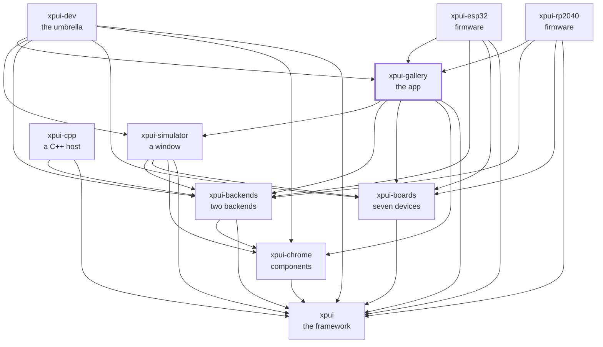

[](https://github.com/XPUI-Framework/xpui-gallery/actions/workflows/ci.yml) [](LICENSE)

<picture>
  <source media="(prefers-color-scheme: dark)" srcset="assets/logo-black.png">
  
</picture>

# Gallery

> [!WARNING]
> Under heavy development. Not production-ready. The API can break without
> notice. Use at your own risk.

Ten captures on seven boards, and the suite that proves the framework paints
the same thing on all of them. Run it and you have a window showing every
widget `xpui` has, on whichever device you name. The same screens are what
the two firmwares flash: they have been run on a [Badger](https://shop.pimoroni.com/products/badger-2040) and a [Tufty](https://shop.pimoroni.com/products/tufty-2040), and they
build for an [X3](https://www.xteink.com/products/xteink-x3) and a [Sticky](https://www.seeedstudio.com/reTerminal-Sticky-p-6861.html), which have no panel driver yet.

Every document in this repository is listed in [docs/README.md](docs/README.md).

## Which crate you want

| | |
|---|---|
| [`gallery`](gallery/) | The reference application, **and a library** both firmwares depend on. Its `tests/` are the seven-board conformance suite: ten captures × seven panels — eight screens, two of them in two states — for 70 golden images, and three more for typefaces. Then row overflow, chrome-for-a-board and the headless simulator loop |
| [`tutorial`](tutorial/) | The screen [the framework's tutorial](https://github.com/XPUI-Framework/xpui-framework/blob/main/docs/tutorial.md) builds, compiled and snapshotted — so the page a beginner follows cannot drift from an API that moved |

**`gallery` is not an example.** Two firmwares link it, and it is where a board
and a backend actually meet — which is why the tests that need both live here
rather than in either.

## Using it

```bash
cargo run -p xpui-gallery -- --board x3     # and x4, x4pro, sticky,
                                            # badger2040, tufty2040, inkyframe
```

A firmware takes the screens as a library. The package is `xpui-gallery`; the
library it links is called `gallery`:

```toml
[dependencies]
xpui-gallery = { git = "https://github.com/XPUI-Framework/xpui-gallery", branch = "main" }
```

```rust
use gallery::{Menu, metrics_for};
use xpui_boards_xteink::X3;

// The screen a firmware opens first, and the chrome it paints with on that
// board.
let _first = Menu::new();
assert!(metrics_for(X3).button_hints_height > 0);
```

It depends on everything below it —
[`xpui`](https://github.com/XPUI-Framework/xpui-framework),
[`xpui-chrome`](https://github.com/XPUI-Framework/xpui-chrome),
[`xpui-boards`](https://github.com/XPUI-Framework/xpui-boards),
[`xpui-backends`](https://github.com/XPUI-Framework/xpui-backends) and
[`xpui-simulator`](https://github.com/XPUI-Framework/xpui-simulator) — because
it is the caller, the one repository that names them all; and
[`xpui-rp2040`](https://github.com/XPUI-Framework/xpui-rp2040) and
[`xpui-esp32`](https://github.com/XPUI-Framework/xpui-esp32) each flash these
screens onto one device. Nothing is on [crates.io](https://crates.io/) yet, which is why the
dependency above is a `git` URL.

## Requirements

[SDL2](https://www.libsdl.org/), which the simulator links: `brew install sdl2` on macOS,
`sudo apt install libsdl2-dev` on [Debian](https://www.debian.org/) and [Ubuntu](https://ubuntu.com/). The tests run headless and
need no display.

## Checking it

```bash
./build-and-test.sh
```

The checks themselves are in [`xtask/`](xtask/) — this repository's own list,
in [Rust](https://rust-lang.org/), holding nothing it does not run. `./build-and-test.sh fix` formats
in place first. A first run of a new golden writes it **and fails**, so nobody
commits a picture they never looked at; [docs/conformance.md](docs/conformance.md)
is how to read a failure and re-bless, and
[docs/contributing.md](docs/contributing.md) is how a change is reviewed.

## Where it sits

Every arrow is a dependency in a `Cargo.toml`, and they all point inward
toward `xpui`, which depends on nothing at all. That is the rule the
organisation is arranged around: a backend can be written without the framework
knowing it exists, and a firmware reaches whatever it needs directly rather
than through whoever happens to sit above it.



## License

MIT — see [LICENSE](LICENSE). Copyright (c) 2026 Thiago Holanda.
