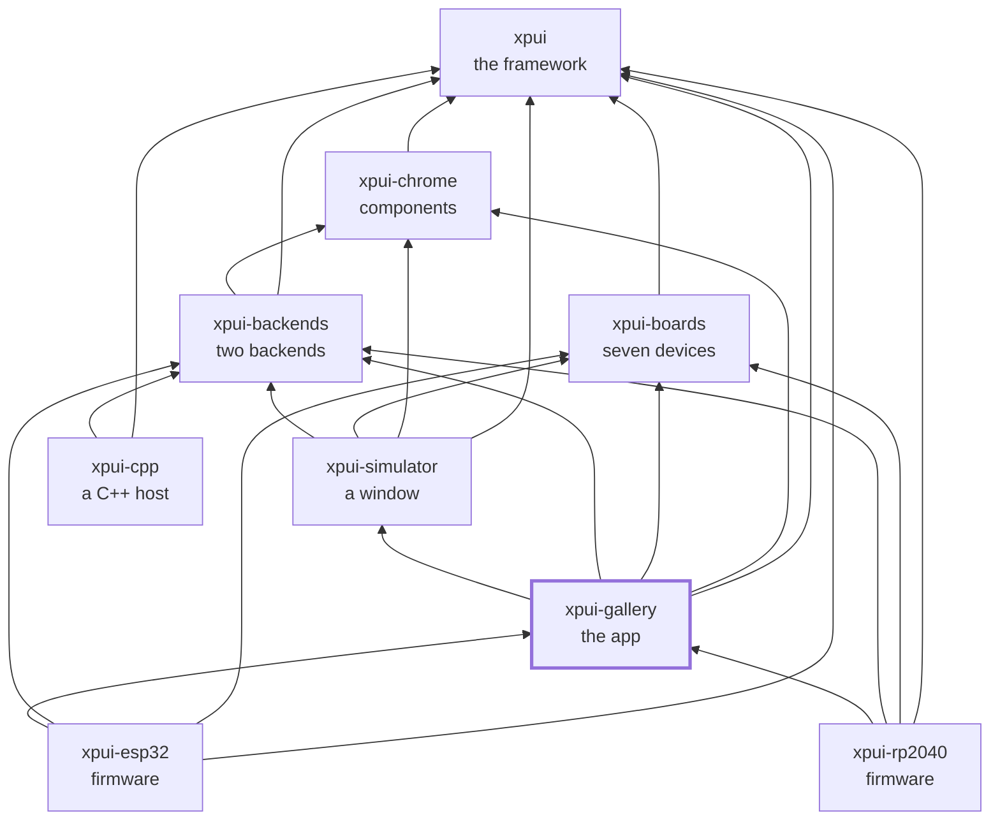

# `xpui-gallery`

> ⚠️ **Under heavy development.** Not production-ready. The API can break
> without notice. Use at your own risk.

Ten captures on seven boards, and the suite that proves the framework paints
the same thing on all of them.

Run it and you have a window showing every widget `xpui` has, on whichever
device you name:

```bash
cargo run -p xpui-gallery -- --board x3     # and x4, x4pro, sticky,
                                            # badger2040, tufty2040, inkyframe
```

## Which crate you want

| | |
|---|---|
| [`gallery`](gallery/) | The reference application, **and a library** both firmwares depend on. Its `tests/` are the seven-board conformance suite: ten captures × seven panels — eight screens, one of them in two states, plus a picker — for 70 golden images, and three more for typefaces. Then row overflow, chrome-for-a-board and the headless simulator loop |
| [`tutorial`](tutorial/) | The screen [the framework's tutorial](https://github.com/XPUI-Framework/xpui-framework/blob/main/docs/tutorial.md) builds, compiled and snapshotted — so the page a beginner follows cannot drift from an API that moved |

**`gallery` is not an example.** Two firmwares link it, and it is where a board
and a backend actually meet — which is why the tests that need both live here
rather than in either.

## Why the seven-board suite is here and not in a backend

A per-board regression is the easiest kind to ship and the hardest to see: the
suite is green, the board you looked at is right, and two of the other six are
broken. That has happened — a change to what the Pimoroni boards *paint* left
what they *send* alone, so every hint label sat one key off and no key produced
Back, on two boards, with 169 tests passing.

`gallery::boards::ALL` is composed here from the three vendor crates — there
is deliberately none across vendors below this level — and a `const` assertion
fails if a vendor gains or loses a board and this list does not follow.

## What it depends on, and what depends on it

Everything below it:
[`xpui`](https://github.com/XPUI-Framework/xpui-framework),
[`xpui-chrome`](https://github.com/XPUI-Framework/xpui-chrome),
[`xpui-boards`](https://github.com/XPUI-Framework/xpui-boards),
[`xpui-backends`](https://github.com/XPUI-Framework/xpui-backends) and
[`xpui-simulator`](https://github.com/XPUI-Framework/xpui-simulator). It is the
one repository that names them all, because it is the caller.

Used by [`xpui-rp2040`](https://github.com/XPUI-Framework/xpui-rp2040) and
[`xpui-esp32`](https://github.com/XPUI-Framework/xpui-esp32), each of which
flashes these screens onto one device.

## Checking it

```bash
./build-and-test.sh
UPDATE_SNAPSHOTS=1 cargo test    # accept intended changes — then READ the diff
open target/screenshots/         # and look at what was rendered
```

A first run of a new golden writes it **and fails**, so nobody commits a
picture they never looked at.

## Where it sits

Every arrow is a dependency in a `Cargo.toml`, and they all point inward
toward `xpui`, which depends on nothing at all. That is the rule the
organisation is arranged around: a backend can be written without the framework
knowing it exists, and a firmware reaches whatever it needs directly rather
than through whoever happens to sit above it.



## License

MIT — see [LICENSE](LICENSE). Copyright (c) 2026 Thiago Holanda.
